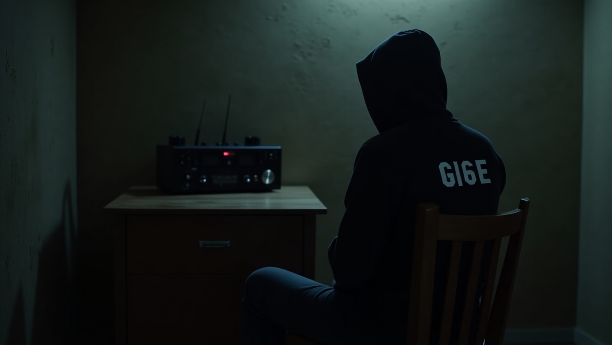

# GI6E

**"It seems capable of extracting sensitive information from specially crafted audio signals."**

HEX-GRID CODEX (abbreviated as HGC) is a custom 6-bit structured encoding system that utilizes a three-bit group identifier (Group Bits) plus a three-bit index identifier (Index Bits) to form 64 unique codes. Its core design philosophy maps letters and numbers onto a two-dimensional block matrix, enabling scalable, hierarchical, and machine-parsable character distribution. This makes it suitable for Morse code extensions, embedded communication protocols, cryptographic tagging, or compact representation of special character sequences.

**"It might just be what espionage has been waiting for."**



# Install

`$ git clone https://github.com/MartinxMax/gi6e.git`

`$ cd gi6e`

`$ pip install -r require.txt`


# Usage 

**1.TEST**

```PYTHON
from lib.GI6E import *
 
if __name__ == '__main__':
    # Get input text from the user
    text = input("Enter text: ")
    # Create an instance of the grid class
    grid_ = grid()
    # Convert the text to grid code, returning the code and file path (if any)
    data, path = grid_.text_2_grid(text)
    # Decode the grid code back to text and print the result
    print("grid_2_text=>", grid_.grid_2_text(data))
    # Convert text to grid code and generate a wav audio file, returning code and audio path
    data, path = grid_.text_2_grid(text, wav=True)
    # Decode text from the generated wav audio file and print the result
    print("wav_2_text=>", grid_.wav_2_text(path))
    # Get and print the list of available loopback audio devices
    print("get_audio_list=>", grid_.get_audio_list())
    # Start real-time grid audio detection and print the output
    print(grid_.realtime_grid_detection())

```

`$ python demo.py`


```bash
Enter text: TEST
grid_2_text=> TEST
[+] Grid file successfully generated: ./lib/history/generate/1752664762.wav
wav_2_text=> ('-.-.-- . --..-. .  . -.-.-. .  . -.-.-. .  . --..-. .  . --..-. .  . -...-. .  . --..-. .  . -.-.-. . ', 'TEST')
wav_2_text=> (['[0] Monitor of ES1371/ES1373 / Creative Labs CT2518 (Audio PCI 64V/128/5200 / Creative CT4810/CT5803/CT5806 [Sound Blaster PCI]) Analog Stereo'], [<Loopback Monitor of ES1371/ES1373 / Creative Labs CT2518 (Audio PCI 64V/128/5200 / Creative CT4810/CT5803/CT5806 [Sound Blaster PCI]) Analog Stereo (2 channels)>])
```

If running on a Windows host, please first install `./install/vbc/VBCABLE_Setup_x64.exe`. Windows typically cannot directly monitor the default speakers, so a virtual audio device is required.

**2.Select listening device**

Use the keyboard arrow keys to select the monitoring device. On Windows, the typical device is `CABLE In 16ch (VB-Audio Virtual Cable)`.


PS: You can also perform automatic monitoring on a specified device without manual selection:

```python
mic_list, mics = grid_.get_audio_list()  # Get all devices
grid_.realtime_grid_detection(mics[0])   # Monitor by specifying a device
```

**3. Monitor Audio Device to Capture Sensitive Information**

Open the directory `./lib/history/generate/` to find the generated GRID audio files and play them.


For conventional decoding methods, this will result in errors.

